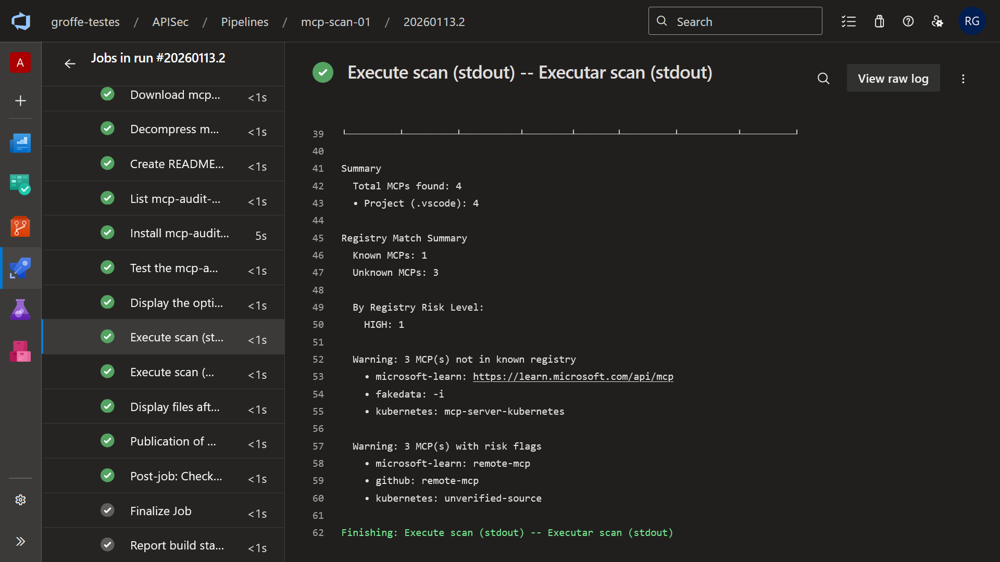
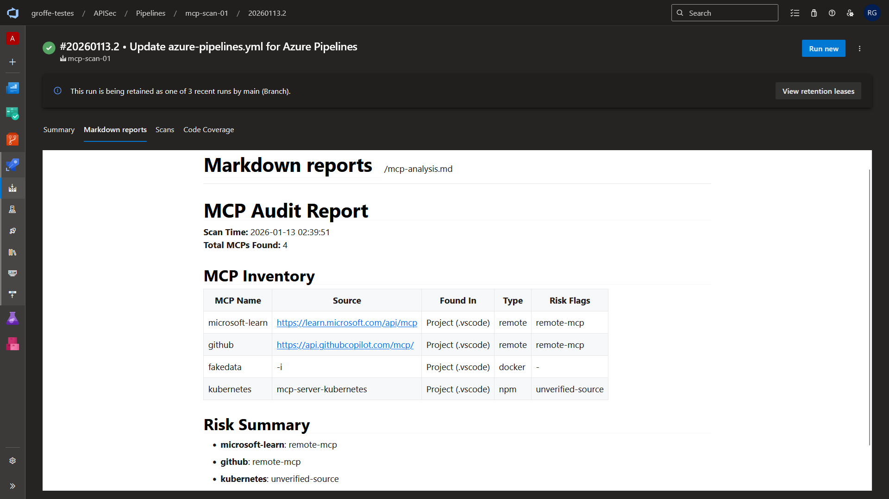

# azdevops-apisec-mcp-audit
Exemplo de uso da ferramenta APIsec MCP Discovery and Audit em um pipeline do Azure DevOps. Testes realizados com vários tipos de MCP Servers (Microsoft Learn, GitHub, Kubernetes - package npm, gerador de dados fake - imagem Docker).

*Example of using the APIsec MCP Discovery and Audit tool in an Azure DevOps pipeline. Tests performed with various types of MCP Servers (Microsoft Learn, GitHub, Kubernetes - npm package, fake data generator - Docker image).*

APIsec MCP Discovery and Audit: https://apisec-inc.github.io/mcp-audit/

---

## Results -- Resultados

Execução do pipeline:

*Pipeline execution:*

Relatório Markdown:

*Markdown report:*

